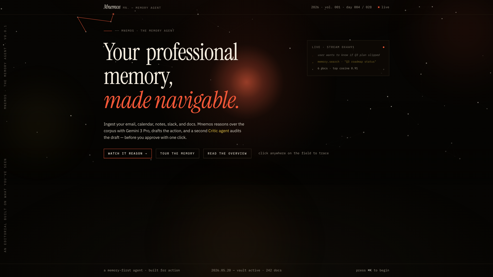
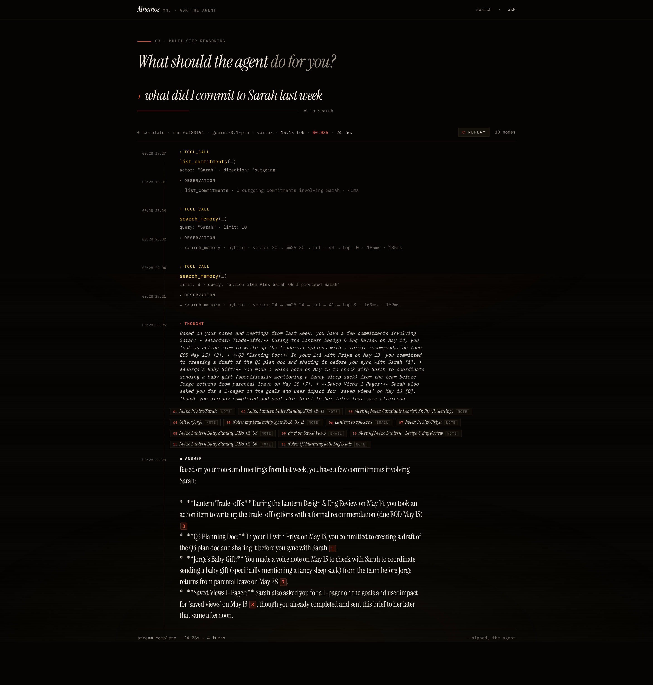
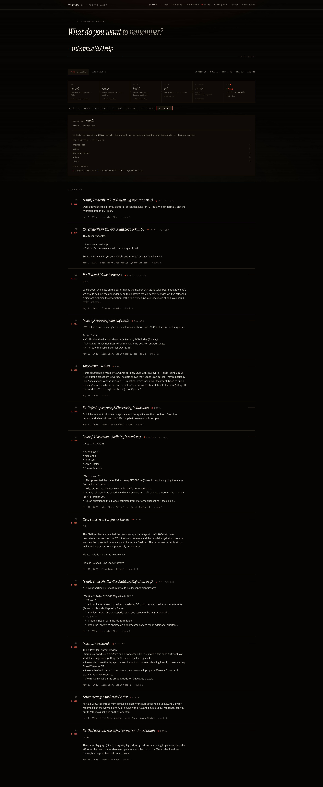
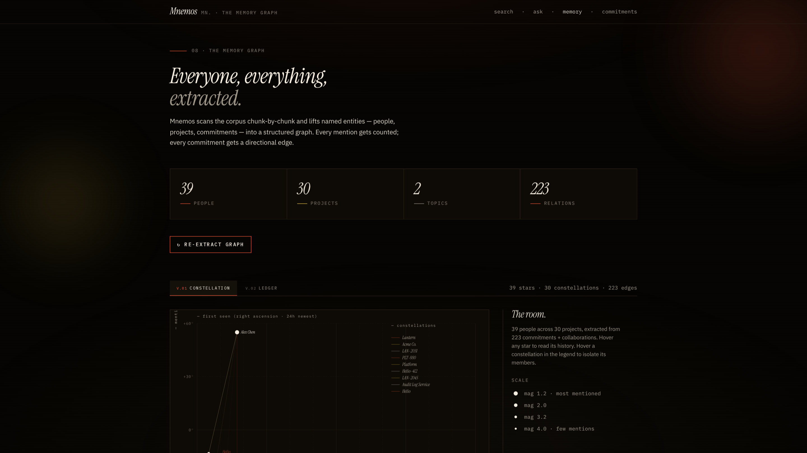
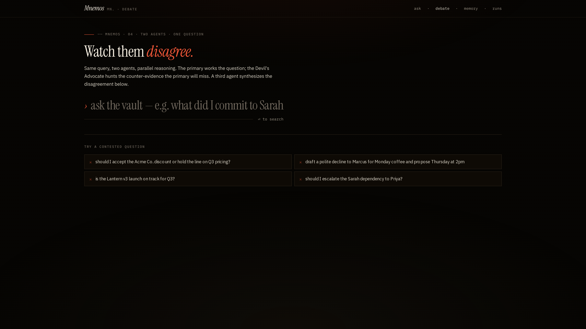
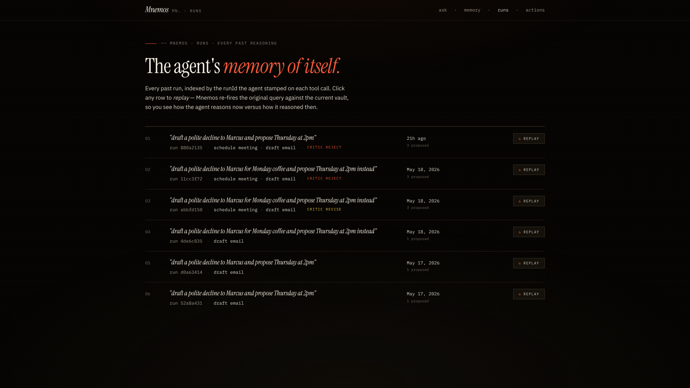
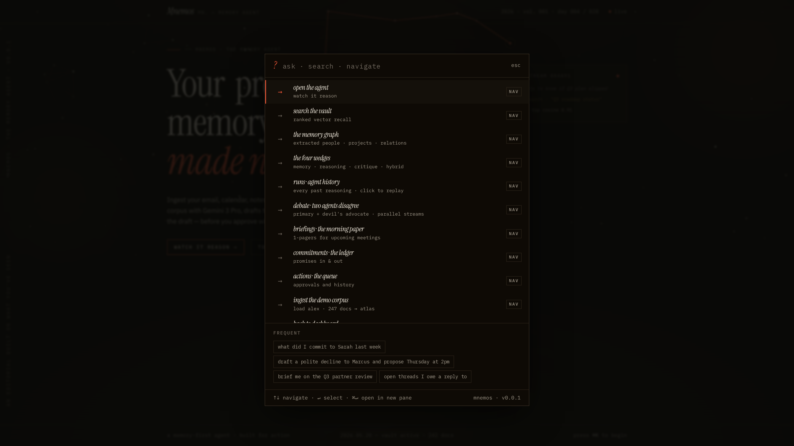
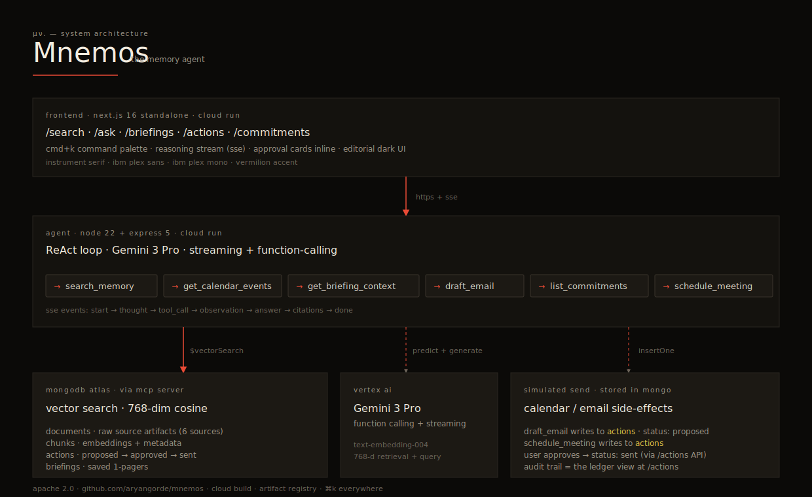

# Mnemos

> An AI agent that takes multi-step actions on top of your professional memory.

Not search. Not notes. An agent that remembers what you've seen across inbox,
calendar, and documents — and *does things about it* under your approval.

Built for the **Google Cloud Rapid Agent Hackathon — MongoDB partner track**.

- **Live:** https://mnemos.aryangorde.com
- **Agent API:** https://mnemos-agent.aryangorde.com
- **Demo (3 min):** *<YouTube link added at submission>*
- **License:** Apache 2.0



## What's special

- **Hybrid retrieval** — every memory query runs `$vectorSearch` *and* `$search` (BM25) in parallel, merges via Reciprocal Rank Fusion, then optionally reranks with a fast LLM pass. The reasoning stream renders the pipeline live; `/search` lets you scrub through each phase to see what it produced.
- **Critic sub-agent** — after every drafted email, a second adversarial agent audits the draft against the cited context. Flags unsupported claims, hallucinated specifics, voice mismatches, safety issues. Renders inline below the ApprovalCard.
- **Graph-augmented retrieval** — when the agent identifies a key entity, it walks the memory graph (people, projects, relations) and pulls in chunks no keyword search would find. The traversal animates inline in the reasoning stream.
- **Multi-agent debate** — `/debate` runs Primary + Devil's Advocate in parallel on the same query, then a Synthesizer produces the consensus answer.
- **Memory as a constellation** — `/memory` plots extracted entities as stars on RA/Dec axes, with project constellations connecting their members.
- **`[N]` claim verification** — every factual claim in the agent's answer ends with a vermilion citation pill. Hover to see the source chunk excerpt.
- **Cost/latency telemetry** — every run shows token counts + estimated USD + latency in the stream header.
- **Multi-turn conversation** — `/ask` remembers prior questions in the same session and threads context.
- **Real Gmail send** — OAuth flow wired; "approve & send" actually fires `gmail.users.messages.send` when configured.

## What it does

| Surface | Path |
|---|---|
| Constellation hero · cold open | `/` |
| The four wedges · overview | `/overview` |
| Ask · SSE reasoning stream with `[N]` citations | `/ask` |
| Memory · SVG constellation chart | `/memory` |
| Search · hybrid retrieval pipeline scrubber | `/search` |
| Debate · two agents in parallel | `/debate` |
| Runs · time-travel agent history | `/runs` |
| Briefings · 1-pager generator | `/briefings`, `/briefings/[id]` |
| Commitments ledger | `/commitments` |
| Actions ledger (with Gmail connect) | `/actions` |
| Ingest · SSE-streamed corpus loader | `/ingest` |
| ⌘K command palette | global |

## Screenshots

| | |
|---|---|
|  |  |
| *Reasoning stream — `[N]` citation pills, hybrid pipeline phases, telemetry chip* | *Hybrid retrieval pipeline scrubber* |
|  |  |
| *Memory constellation chart* | *Multi-agent debate* |
|  |  |
| *Time-travel runs · click to replay* | *⌘K command palette* |

## Stack

| Layer | Tech |
|---|---|
| Frontend | Python 3.12 + FastHTML (HTMX + SSE), server-rendered, no build step ([apps/web-py](apps/web-py)) |
| Agent | Python 3.12 + FastAPI, hand-rolled ReAct loop, Server-Sent Events ([apps/agent-py](apps/agent-py)) |
| LLM | Claude (Sonnet 4.5) via Amazon Bedrock Converse — streaming + function calling; pluggable to Gemini/Vertex via `LLM_PROVIDER` |
| Embeddings | Amazon Titan v2 (Bedrock), 1024-d; pluggable via `EMBED_PROVIDER` |
| Memory | MongoDB Atlas Vector Search + Atlas Search (BM25) + a graph collection, via `motor` (async driver) |
| Hosting | AWS Lightsail (web + agent + Caddy via docker-compose) — see [deploy/aws](deploy/aws); Cloud Run also supported |

## Local setup

```bash
cp .env.example .env.local
# fill MONGODB_URI, GOOGLE_CLOUD_PROJECT, GOOGLE_APPLICATION_CREDENTIALS

npm run setup:agent        # python venv + agent backend deps
npm run setup:web          # python venv + frontend deps
npm run setup:mongo        # create the Atlas vector + BM25 indexes

npm run dev:agent   # FastAPI agent on http://localhost:8787
npm run dev:web     # FastHTML frontend on http://localhost:3000

npm run seed -- --load     # generate + ingest corpus + build graph/ledger (~5–10 min)
```

## Real Gmail + Calendar

Approvals **simulate** sends until a Google account is connected. To make them real:

1. **Google Cloud Console** → enable the **Gmail API** and **Google Calendar API**, create an
   **OAuth 2.0 Client** (type: *Web application*), and register the redirect URI(s):
   - local: `http://localhost:8787/auth/google/callback`
   - deployed: `https://<your-agent-domain>/auth/google/callback`
2. Put the client credentials in `.env.local` (never commit them):
   `GMAIL_OAUTH_CLIENT_ID`, `GMAIL_OAUTH_CLIENT_SECRET`, `GMAIL_OAUTH_REDIRECT_URI`.
3. Restart the agent, open **/approve**, and click **connect google →** (one-time consent).
   The `google` pill in the topbar flips to `live`; approving now sends real email via
   `gmail.send` and books real events via `calendar.events`.

For Cloud Run deploys, set the repo secrets `GMAIL_OAUTH_CLIENT_ID` / `GMAIL_OAUTH_CLIENT_SECRET`
and the repo variable `GMAIL_OAUTH_REDIRECT_URI` — the deploy workflow provisions them onto the
agent service automatically.

> While the OAuth consent screen is in *Testing* mode, add yourself as a test user; Google
> expires refresh tokens after 7 days in that mode. Publish the app to keep the connection alive.

## LLM provider

Generation and embeddings are provider-pluggable, selected by env vars — no code change to
switch:

| Env | Options | Default |
|---|---|---|
| `LLM_PROVIDER` | `bedrock` (Claude) · `gemini` (AI Studio key) · `vertex` | Bedrock when AWS creds present |
| `EMBED_PROVIDER` | `bedrock` (Titan) · `gemini` · `vertex` | follows the LLM provider |

The default deployment ([deploy/aws](deploy/aws)) runs **Claude Sonnet 4.5** and **Titan
embeddings** on Amazon Bedrock — fully on AWS, no Google API key. The topbar pill and
`/ready` report the live provider + model. To fall back to Gemini, set `LLM_PROVIDER=gemini`
with a `GEMINI_API_KEY` (or `vertex` with a GCP project); embeddings follow unless
`EMBED_PROVIDER` overrides. Titan v2 is 1024-d, so switching embedding provider requires a
one-time re-embed + index rebuild (`scripts/reembed_chunks.py` + `scripts/setup_mongo_index.py`).

## Deploy

```bash
bash scripts/deploy-agent.sh                               # prints AGENT_URL
NEXT_PUBLIC_AGENT_URL=$AGENT_URL bash scripts/deploy-web.sh
```

Full runbook: [docs/DEPLOY.md](docs/DEPLOY.md).

## Three demo scenarios that always work

| | Prompt | Surface | Time |
|---|---|---|---|
| Q&A | *what did I commit to Sarah last week* | `/ask` | 10–35s |
| The wedge | *draft a polite decline to Marcus for Monday coffee and propose Thursday at 2pm instead* | `/ask` | 60–90s |
| Search | *inference SLO slip* | `/search` | <300ms |

## Architecture



Details: [docs/ARCHITECTURE.md](docs/ARCHITECTURE.md).

## License

Apache 2.0 — see [LICENSE](LICENSE).
